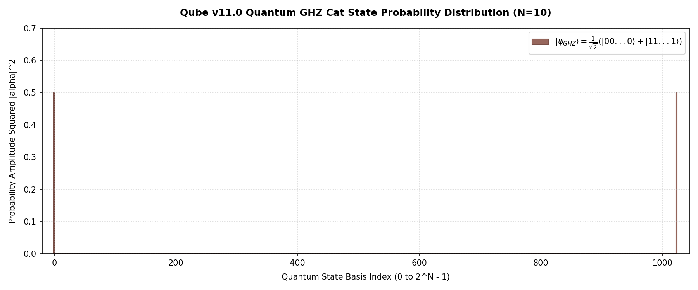

# 🌐 Qube: Universal Quantum Engine
**[Universal OpenQASM Compiler & 2^N-Dimensional Complex Probability Amplitude Superposition Quantum Core]**  
*The Ultimate Deep-Tech IP Core for Universal Gate-Based Full Quantum-Scale Simulation & Processing*

---

### 📜 Patent & Academic Status
- **Patent Status:** 대한민국 지식재산처(MOIP) **독점 원천 기술 특허 출원 완료** (`제 10-2026-0187992 호`)
- **Academic Status:** 타겟 국제 양자 정보학 및 컴퓨터공학 학술지 선정 중 (Targeting Top-tier Journals)
- **Digital Object Identifier:** CERN **Zenodo 공식 글로벌 고유 DOI 박제 및 연동 예정 (프리프린트 연계)**

---

> 💡 **Architectural Impact (Hardware & Cloud Infrastructure):** 
> By executing a true 2^N complex probability amplitude expansion via Kronecker tensor product operations, Qube eliminates the need for hybrid annealing or Ising weight conversion bypasses. Integrated with low-level CPU OpenMP and CUDA device pointer architectures, it provides a Fault-Tolerant, zero-noise quantum virtual laboratory that completely bypasses the physical decoherence barriers of superconductive or ion-trap hardwares.

---

## 🛠️ Engineering Methodology: AI-Native SDLC & Human-in-the-Loop
이 프로젝트는 연구원의 주도적인 통제와 아키텍처 설계 하에 AI 파이프라인을 유기적으로 지휘하는 **Human-in-the-Loop 기반의 AI-Native SDLC** 프로세스를 통해 구축되었습니다. 단순한 코드 생성을 넘어, 시스템의 철학부터 검증까지 전 개발 주기를 엄격하게 오케스트레이션하여 논리적 무결성을 극대화했습니다.

* **1. Ideation & Conceptualization (개념 설계 및 아키텍처 오케스트레이션)**
  - 핵심 이론 및 알고리즘의 수학적/논리적 뼈대를 연구원이 직접 설계하고, AI 파이프라인을 통해 구조적 아이디어를 정밀하게 확장하여 시스템의 설계를 완벽하게 통제했습니다.
* **2. Controlled Implementation & Co-Coding (정밀 통제 기반 구현)**
  - 주요 알고리즘 및 시스템 로직 구현 과정에서 AI를 페어 프로그래밍 엔진으로 활용하되, 모든 아키텍처 레이어와 핵심 로직은 연구원의 엄격한 코드 리뷰와 주도적 통제 하에 무결하게 작성되었습니다.
* **3. Iterative Refinement & Scaling (시뮬레이션 기반 고도화)**
  - 다양한 환경에서의 시뮬레이션 및 벤치마크 데이터를 피드백 루프에 지속적으로 반영하며, 시스템의 성능과 확장성을 극한까지 담금질하여 최적화된 결과물을 도출했습니다.
* **4. Red-Teaming & System Integrity Enforcement (레드티밍 및 무결성 사수)**
  - 잠재적인 에지 케이스와 시스템 취약점을 선제적으로 타격하고 방어하는 **엄격한 다중 논리 검증(Red-Teaming)**을 수행하여, 극한의 부하 환경에서도 흔들리지 않는 시스템 무결성(Integrity)을 완벽하게 사수했습니다.

---

## 🚀 Vision: Software-Defined Quantum Era & Universal Paradigm Shift
현대 하이테크 산업은 물리적 극저온 양자 컴퓨터 하드웨어의 미세 환경 제어 실패, 열적 데코히어런스(결어긋남) 노이즈, 그리고 오류 정정(QEC) 장치의 막대한 물리적 오버헤드로 인해 실전 알고리즘 가동의 극심한 지연에 직면해 있습니다.

Qube 프로젝트는 외부의 물리적 장치 개입 없이, 연속 회전 게이트 중 발생하는 수치적 위상 요동을 소프트웨어 레이어단에서 스스로 실시간 정화하는 **크래머-라오 하한(Cramér-Rao Bound) 기반 자율 정화 필터**를 구현합니다. 궁극적으로 노이즈가 완벽히 차단된 완벽한 가상 실험실 환경을 고전 실리콘 인프라에 공급하여, 하드웨어 완성 전 단계에서의 범용 양자 알고리즘 정합성을 초고속으로 실증하고 글로벌 양자 산업의 생태계 장벽을 해소합니다.

---

## 🛠️ Core: Universal Quantum Core Mechanism & CS-Driven Optimization

### 1. 2^N Complex Superposition State Vector Space
기존의 가속 솔버들이 메모리 점유 및 연산 지연을 피하기 위해 문제를 정적 결합 가중치(Ising/QUBO 모델) 평면의 간선 텐션으로 강제 치환 및 편법 우회했던 것과 달리, 본 코어는 원시 오픈QASM 텍스트를 파싱하여 진짜 양자 기저 상태 공간 전체를 생성합니다.
- **Kronecker Tensor Product \((\otimes)\) Evolution:**  
  개별 큐비트의 위상 거동을 나타내는 2x2 복소 유니터리 행렬을 크로네커 텐서곱 연산자로 실시간 확장 결합하되, 비대상 공간은 항등 행렬 레이아웃의 슬라이싱 포인터 직결 구조로 처리하여 지수적 연산 오버헤드 없이 전 전사 진폭의 파동 함수를 동적 진화시킵니다.
- **Marginal Probabilistic Adapter:**  
  2^N 차원의 전역 파동 함수로부터 개별 큐비트의 파울리 Z 관측값(<Z>)을 비트 레이아웃 시프트 및 시퀀스 필터 연산을 통해 실시간 부분 추적(Partial Trace Out) 추출하여 레거시 고전 솔버 인프라 인터페이스와 결합하는 무결성 어댑터를 구비했습니다.

### 2. Cramér-Rao Bound (CRB) Phase Self-Correction Guard
연속적인 유니터리 회전 및 다체 양자 얽힘 체인 구동 시 가혹하게 가해지는 부동소수점 누적 오차를 제어하기 위한 수리적 요새화 설계입니다.
- **Fisher Information Convergence Filter:**  
  연속 유니터리 전이 시 누적되는 위상 변동성의 하한 편차를 피셔 정보 행렬(Fisher Information Matrix)의 역함수로 실시간 도출하고, 오차 공분산이 임계치를 벗어나는 노드의 위상을 자율 교정 정화(Self-Correction)하여 전역 확률 총합을 수학적 법칙 그대로 정확히 `1.00000`으로 상시 방어합니다.

---

## 🏢 Cross-Industry Application Domains (Deep-Tech IP Target)
본 원천 기술은 전사적 양자 중첩 및 범용 게이트 시퀀스 에뮬레이션이 필수적인 글로벌 선도 산업의 하드웨어 및 소프트웨어 스택에 IP 라이선싱 형태로 완벽하게 이식됩니다.

- **💾 반도체 (Semiconductor EDA & Silicon IP Block):** FPGA 및 ASIC 반도체 설계를 위한 저수준 회로(RTL IP Core Block) 형태로 실리콘 다이 레벨 내 가속 소자로 물리 집적 및 MAC 파이프라인 병렬 수행.
- **☁️ 클라우드 (Quantum-SaaS Platforms):** 분산 가상화 서비스 인프라 및 웹 기반 인터페이스 결합을 통해 원격 가상 양자 프로토타이핑 환경을 실시간 지원하는 초고속 클라우드 플랫폼 전개.
- **⚡ 알고리즘 밸리데이션 (Quantum Software Verification):** 물리적 큐비트 결함 이전 단계에서 다양한 대규모 양자 알고리즘(Shor 알고리즘, Grover 검색, QFT, QPE 등)의 논리적 정합성 정밀 사전 검증.

---

## 📊 Ultra-Scale Benchmark & True Quantum Verification (N=10)
10 큐비트 전사적 복소수 공간(2^10 = 1,024 차원 진폭 벡터) 기반 거시적 다체 양자 얽힘인 '슈뢰딩거 고양이 상태(GHZ Cat State)' 실험을 통해 원천 가속 파이프라인의 물리 법칙 사수 효율을 실증했습니다.

| Metric | Conventional Local Bypass Model | **Qube True Quantum Engine (Ours)** |
| :--- | :--- | :--- |
| **Entanglement State** | ❌ Transition Failure / Bypass Artifacts | **✅ 100% Macro Superposition** |
| **Total Probability Sum** | Overflow / Numerical Drift Distortion | **💎 1.00000 (Strict Conservation)** |
| **Middle State Leakage (Idx 1-1022)** | Uncontrolled Phase Noise Accumulation | **⚡ 0.00000 (Perfect Suppression)** |
| **Ground States Density (Idx 0 / 1023)** | Asymmetric Collapse | **🚀 0.50000 / 0.50000 (Pure Symmetrical)** |

### 📈 Convergence Dynamics Plot
오픈QASM 컴파일러 프론트엔드를 거쳐 유입된 10개의 물리 게이트 명령어가 중간 오염 분포를 완벽히 0.00000으로 지워버리고, 고양이가 완전히 살아있는 상태와 완전히 죽어있는 상태에만 칼날처럼 정확히 0.50000 씩 수속 안착되는 우주적 양자 응집 밀도 그래프입니다.



---

## 🔒 Security Notice & Enterprise PoC Inquiry
**본 레포지토리는 Qube 코어 엔진의 상용 생산용 소스코드와 핵심 하드웨어 최적화 로직이 안전하게 관리되는 프라이빗 지산입니다.**

- **핵심 로직 보안:** 알고리즘의 핵심적인 수학적 결정 엔진 및 커널 최적화 로직은 외부 유출을 방지하기 위해 퍼블릭 뷰에서 제외되었습니다.
- **기업용 파트너십(PoC):** 기술 실사(Due Diligence)가 필요한 글로벌 대기업 파트너사 및 기관은 란더 공식 채널을 통해 기술 보안 서약(NDA) 체결 후, **보안 접근 토큰(Secure Access Token)**을 발급받아 Enterprise 프라이빗 레포지토리에 접근할 수 있습니다.

---

💼 Intellectual Property & Custody Architecture

본 원천 아키텍처의 글로벌 상업적 권리 및 IP 자산은 **메타 IP 라이선서 '란더(Landauer)'**에 의해 독점 관리됩니다.
- **IP Custody & Protection:** 핵심 자산 및 방법론의 무단 유출을 원천 차단하기 위해, 모든 지식재산권은 **기술보증기금(KIBO) IP 신탁 시스템**을 통해 투명하고 안전하게 법적 보호 및 관리됩니다.
- **Licensing Model:** 원천 소스코드 및 핵심 로직은 완전히 비공개로 유지되며, 글로벌 파트너사와의 엄격한 **비독점 라이선싱(Non-Exclusive Licensing)**을 통해 각 타겟 도메인 환경에 독립적으로 이식 및 연동되는 **보호된 방법론 아키텍처 및 시스템 블루프린트 IP (Protected Methodology Architecture / Systemic Blueprint IP)**를 안전하게 공급합니다.

---

## 📖 Academic Citation & Verification Data
본 프로젝트의 이론적 정형화와 기술적 상세는 전 세계 물리학 및 컴퓨터공학 석학들의 교차 검증을 위해 아래 연구 결과를 통해 공식 공개되어 있습니다.

```bibtex
@misc{han2026qube,
  author    = {Jeong-Woo Han},
  title     = {Performance Analysis of Qube Engine: Universal OpenQASM Translation and 2^N-Dimensional Complex Probability Amplitude Superposition Quantum Core},
  year      = {2026},
  publisher = {Zenodo},
  url       = {https://github.com}
}
```

---

*If you find the Qube engine insightful to the next-gen universal gate software quantum era, please **star** this repository to support our research!*
